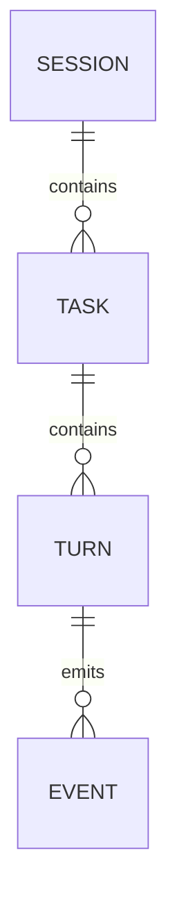
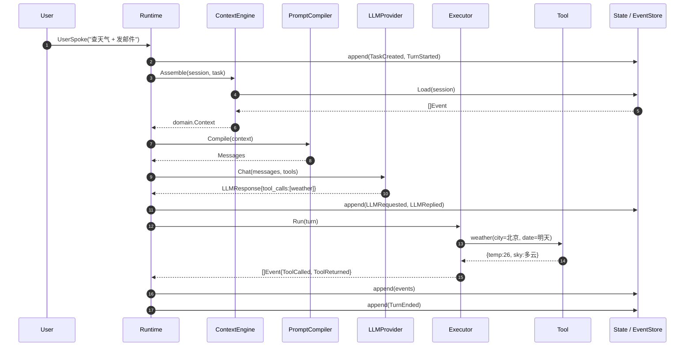

# Chapter 1 · Runtime Domain Model

> 这本书讲的是工程,不是理论。第一章先把 Runtime 内部的世界画清楚:**它管什么、不管什么,用什么词描述发生的一切。** 后面每一章都会往回引用这里的名词。

---

## 1.1 一段"能跑但会出事"的代码

生产上第一版 Agent 通常长这样。为了突出问题,我们把它压缩到最短。两种语言的写法几乎一一对应——本书全程给出 Go 与 Rust 两份参考实现:

**Go:**

```go
// 玩具版:能演示,扛不住生产。
func Run(ctx context.Context, userInput string, tools []Tool) (string, error) {
    msgs := []Message{{Role: "user", Content: userInput}}
    for {
        resp, err := llm.Chat(ctx, msgs, tools)
        if err != nil {
            return "", err
        }
        if len(resp.ToolCalls) == 0 {
            return resp.Text, nil
        }
        for _, call := range resp.ToolCalls {
            result := dispatch(call)                             // 真正跑工具
            msgs = append(msgs, Message{
                Role: "tool", ToolCallID: call.ID, Content: result,
            })
        }
        msgs = append(msgs, resp.Assistant)
    }
}
```

**Rust:**

```rust
// 玩具版:能演示,扛不住生产。
fn run(user_input: &str, tools: &[Tool]) -> Result<String, Error> {
    let mut msgs = vec![Message::user(user_input)];
    loop {
        let resp = llm::chat(&msgs, tools)?;
        if resp.tool_calls.is_empty() {
            return Ok(resp.text);
        }
        for call in &resp.tool_calls {
            let result = dispatch(call);                          // 真正跑工具
            msgs.push(Message::tool(&call.id, result));
        }
        msgs.push(resp.assistant);
    }
}
```

跑通 demo 只需要这些。但只要放进任何一个真实系统,下面这些事迟早会一次性砸下来:

1. **崩溃**:`Run` 在跑到一半时进程被 OOM Killer 干掉。`msgs` 在栈上,什么都没落地——用户按 F5,一切从头再来。
2. **中断**:用户中途取消请求。`send_email` 已经把邮件发出去了。你没法回滚,也没法在 UI 上准确告诉用户"邮件到底发没发"。
3. **并发**:同一个用户同时开了两个对话,各自持有一个 `msgs` 切片。它们背后共享的钱包/日程/记忆开始互相覆盖。
4. **观测**:一次 10 秒的响应,慢在 LLM、慢在工具、还是慢在你自己拼 Prompt？循环里一个 span 都没打。
5. **成本**:某一轮 `msgs` 涨到 30K token,账单当天就出问题。你在代码里没有任何地方能拦下这次调用。
6. **回放**:生产偶发一次"回复奇怪"的 case。你想在本地复现——发现除了那句 `user_input`,什么上下文都拿不到。
7. **审计**:三个月后运营找过来问"这封邮件谁授权发的"。日志里只有一行 `INFO llm called`。

这七件事,业务代码里再打补丁也治不好。它们是**横切关注点**——每个 Agent 都会撞上,每个团队都在各自重造。

**Runtime 就是把这些关注点从业务里抠出来、放到统一位置的那一层。**

参见 [ADR-001](../adr/ADR-001-runtime-domain.md) 的边界定义。这一章讲**它内部世界的名词表**:Session、Task、Turn、Event。

---

## 1.2 建模的第一个决策:事件优先,不是对象优先

要给上面 7 个问题一个统一的底座,最关键的一步是选"**什么是事实**"。

工程上有两种典型选择:

**A. 对象优先（Object-first）**
维护一个"当前状态"结构体——消息切片、工具结果、记忆——就地更新。玩具代码里的 `msgs` 就是这种。
写起来最快,但"过去"不存在。崩溃恢复靠周期性快照,回放靠日志拼凑,审计只能查文本日志。上面 7 件事没有一件被彻底解决。

**B. 事件优先（Event-first / Event Sourcing）**
只把**发生了什么**作为原始事实——`UserSpoke`、`LLMReplied`、`ToolCalled`、`ToolReturned`——追加式记录、不可变。当前状态是这条事件流的**折叠结果**。
崩溃恢复 = 从最近快照 replay 事件；回放 = 重放事件；审计 = 事件本身就是审计日志；观测 = 事件天然是 Span 边界。代价是写代码要克制"顺手改一下"的冲动。

**本书选 B。** 第 3 章会展开 Event 的类型系统与实现,这里先接受一个约定:

> Runtime 里唯一改变状态的方式是**追加一个 Event**。所有其它对象都是 Event 流的视图。与 DDD / Event Sourcing 的词汇对应见 [ADR-003](../adr/ADR-003-ddd-mapping.md)。

这个决策塑造了后面所有的名词:Session / Task / Turn 都不是"活的对象",它们是**在某个粒度上聚合 Event 得到的视图**。

---

## 1.3 四层核心对象

**Session、Task、Turn、Event**。四个词,从外向内看是这个粒度:

```
Session  ──  一段用户与系统的关系
  └─ Task  ──  用户想做成的一件具体事情
      └─ Turn  ──  Runtime 与 LLM 的一次往返
          └─ Event  ──  一次原子的状态变化
```

对应结构见 [`runtime-go/domain/domain.go`](../runtime-go/domain/domain.go) 与 [`runtime-rs/src/domain/mod.rs`](../runtime-rs/src/domain/mod.rs)——两份实现字段逐一对齐,任选一种阅读。下面挨个说。

### Session — 会话周期

**是什么**:一个身份（用户 / API Key / 服务账号）与系统的一次会话周期。

**为什么需要**:它是外部世界看得到的最大单元。前端拿到的是 `sessionId`,账单按 Session 汇总,会话记忆挂在 Session 上,权限也按 Session 授予。

**生命周期**:

- 创建:用户开一个新对话；或系统按策略切分（例如"超过 24 小时无活动自动新起一个"）。
- 存活期间:承载 0、1、多个 Task。
- 结束:显式关闭 / 超时 / 被合并。

**骨架**（节选自 `domain/`）:

**Go:**

```go
type Session struct {
    ID           string
    Principal    string            // 谁的 session
    CreatedAt    time.Time
    LastActiveAt time.Time
    Metadata     map[string]string
}
```

**Rust:**

```rust
pub struct Session {
    pub id: String,
    pub principal: String,                       // 谁的 session
    pub created_at: Option<SystemTime>,
    pub last_active_at: Option<SystemTime>,
    pub metadata: HashMap<String, String>,
}
```

**Session 不是什么**:

- **不是"一个前端窗口"** —— 一个窗口可以切多个 Agent（多个 Session）,一个 Session 也可以跨多个窗口继续。
- **不是"上下文窗口"** —— 上下文是 Session 状态的一个投影,不等于 Session 本身。

### Task — 一件事情

**是什么**:Session 里用户想做成的一件具体事情。

**为什么单独一层**:

- 一个 Session 里会说多件事:"帮我订机票"、"顺便把上周的报销单发出去"——这是两个 Task。
- Task 是**取消、重试、超时、预算**的自然单位。取消"订机票"不该误伤"发报销单"。
- Task 是**成败评估**的自然单位。Session 无所谓成败,Task 有。

**生命周期**:`pending → running → (succeeded | failed | canceled | timeout)`。

**Go:**

```go
type Task struct {
    ID        string
    SessionID string
    Goal      string
    Status    TaskStatus
    Budget    Budget      // 允许消耗的 tokens / cost / wall-clock
    StartedAt time.Time
    EndedAt   time.Time   // 零值表示未结束
}
```

**Rust:**

```rust
pub struct Task {
    pub id: String,
    pub session_id: String,
    pub goal: String,
    pub status: TaskStatus,
    pub budget: Budget,                          // tokens / cost / wall-clock
    pub started_at: Option<SystemTime>,
    pub ended_at: Option<SystemTime>,            // None 表示未结束
}
```

**关于嵌套**:Task 可以有子 Task（"订机票"下面挂"查航班"、"选座"）,代价是调度和观测复杂度显著上升。第 7 章 Task Graph 会展开；本章保守起见把 Task 视作扁平的。

### Turn — 一次往返

**是什么**:Runtime 与 LLM 的**一次完整往返**——从"决定要 call LLM"到"这一轮所有工具调用都返回、状态更新完毕"。

**为什么单独一层**:

- 它是**成本记账**的自然粒度（每个 Turn 一次 LLM billing）。
- 它是**观测**的自然粒度（一个 Turn 一个 Trace Span）。
- 它是**重试**的自然粒度（LLM 超时 → 重试这个 Turn,不需要回退整个 Task）。
- 它是**Checkpoint** 的自然对齐点（见第 9 章）。

**边界要小心**:一次 LLM 响应可能包含多个 `ToolCalls`。工具全部完成、结果全部回填、准备下一次 LLM 调用之前——这才算 Turn 结束。**"LLM 一次响应" ≠ "一个 Turn"**,除非这次响应里没有工具调用。

**Go:**

```go
type Turn struct {
    ID        string
    TaskID    string
    Index     int         // 该 Task 内的第几个 Turn
    Status    TurnStatus
    TokensIn  int
    TokensOut int
    CostUS    float64
    LatencyMS int64
}
```

**Rust:**

```rust
pub struct Turn {
    pub id: String,
    pub task_id: String,
    pub index: i32,                              // 该 Task 内的第几个 Turn
    pub status: TurnStatus,
    pub tokens_in: i64,
    pub tokens_out: i64,
    pub cost_us: f64,
    pub latency_ms: i64,
}
```

### Event — 原子事实

**是什么**:Runtime 中一次原子的状态变化的不可变记录。

**为什么它是"最底层的事实"**:见 §1.2。

**Go:**

```go
type Event struct {
    ID        string
    SessionID string
    TaskID    string
    TurnID    string
    Type      EventType
    Payload   EventPayload  // 与 Type 匹配的负载(marker interface)
    TS        time.Time
    CausedBy  string        // 上游 Event id,构成因果链
    Seq       int64         // 每 session 单调递增;由 EventStore 分配(ch03 §3.3.1)
}
```

**Rust:**

```rust
pub struct Event {
    pub id: String,
    pub session_id: String,
    pub task_id: String,            // 空串表示不归属任何 Task
    pub turn_id: String,
    pub ts: Option<SystemTime>,
    pub caused_by: String,          // 上游 Event id,构成因果链
    pub payload: EventPayload,      // 封闭 enum;类型即负载
    pub seq: i64,                   // 每 session 单调递增;由 EventStore 分配(ch03 §3.3.1)
}
```

Rust 版没有单独的 `Type` 字段——EventType 的判别就是 `match payload`,编译器强制穷举。

**典型的 EventType**（完整清单见 `domain/domain.go`）:

- `SessionOpened`
- `TaskCreated` / `TaskEnded`
- `TurnStarted` / `TurnEnded`
- `UserSpoke`
- `LLMRequested` / `LLMReplied`
- `ToolCalled` / `ToolReturned`
- `ContextCompressed`

**Event 是不可变的**。要修正"过去的错误",只能追加新的 Event（例如 `ToolResultOverridden`）,不能改写旧的。这条纪律是 §1.2 决策落地的核心,也是所有回放/审计能力的前提。

**Payload 是类型化的**,不是 `map[string]any` / `serde_json::Value`。每种 `EventType` 对应一个具体的 Payload 结构,靠语言级机制收紧——编译器会拒绝把随便一个东西塞进 `Event.Payload`。两种语言的做法各有偏好:

**Go:marker interface + Payload\* struct**。完整定义见 [`runtime-go/domain/event_payloads.go`](../runtime-go/domain/event_payloads.go)。

```go
type EventPayload interface {
    eventPayload()  // unexported marker,禁止外部随意实现
}

type PayloadUserSpoke  struct { Text string }
type PayloadToolCalled struct {
    CallID, Name, Arguments string  // Arguments 为 JSON 字符串
}
type PayloadToolReturned struct {
    CallID, Content string
    IsError         bool
}
// ...其余 EventType 各配一个 struct
```

消费方类型安全地断言:`payload, ok := evt.Payload.(PayloadToolCalled)`。

**Rust:封闭 enum**。完整定义见 [`runtime-rs/src/domain/event_payloads.rs`](../runtime-rs/src/domain/event_payloads.rs)。

```rust
pub enum EventPayload {
    SessionOpened(PayloadSessionOpened),
    UserSpoke(PayloadUserSpoke),
    ToolCalled(PayloadToolCalled),
    ToolReturned(PayloadToolReturned),
    // ...其余 variant
}

pub struct PayloadToolCalled  { pub call_id: String, pub name: String, pub arguments: String }
pub struct PayloadToolReturned { pub call_id: String, pub content: String, pub is_error: bool }
```

消费方 `match &evt.payload { EventPayload::ToolCalled(p) => ..., _ => ... }`,编译器强制穷举——新增一种 EventType,所有还没处理它的 `match` 立刻编译不过。这比 Go 的 marker interface 更严格。

**两种做法本质相同**:都在语言级机制上把"什么能作为 payload"卡住,拿到三条相同的收益:

1. **类型安全的消费** —— 拼错字段名 / 忘记处理某种 EventType 都在编译期报出。
2. **schema 演进有据可查** —— payload 字段变更体现在编译错误和 diff 里,`map[string]any` 只会在运行期悄悄挂掉。
3. **序列化时按 Type 分派** —— 第 3 章 EventStore 的实现会用一张 `EventType → factory` 表反序列化,marker interface / 封闭 enum 正好卡住"什么类型可注册"的边界。

代价:新增 EventType 需要同时加一个 struct（Go 加 `eventPayload()` 空方法,Rust 加一个 enum variant）。相比"编译期发现 payload 用错了"的收益,这点样板代码值得。

---

## 1.4 对象关系



原图见 [`diagrams/ch01-object-model.mmd`](../diagrams/ch01-object-model.mmd)。

三层聚合 + 一层原子事实。每层解决一类问题:

| 层次    | 解决的问题                       |
| ------- | -------------------------------- |
| Session | 身份、权限、账单、会话记忆的归属 |
| Task    | 目标、取消/重试、预算、成功与否  |
| Turn    | LLM 计费、Trace Span、Checkpoint |
| Event   | 事实、回放、审计、恢复           |

如果把某一层去掉:

- 去掉 **Session** → 权限和会话级记忆无处附着。
- 去掉 **Task** → 一个"会话"里若同时有两件事,取消一件会误伤另一件。
- 去掉 **Turn** → 成本与观测粒度要么太粗（Task 层）要么太细（Event 层）,两头都不合适。
- 去掉 **Event** → 回到"对象优先",§1.1 的 7 个问题全部回来。

### 1.4.1 七个痛点如何被四层对象接住

§1.1 那 7 件砸下来的事,逐条对应到 §1.3 的四层对象上:

| §1.1 痛点                             | 主要靠哪一层解决   | 具体机制                                                                                                                                                  |
| ------------------------------------- | ------------------ | --------------------------------------------------------------------------------------------------------------------------------------------------------- |
| 1. **崩溃**（进程被杀,`msgs` 丢）    | **Event** + Turn   | 每条 Event 追加到 EventStore 就落盘；重启后从最近的 Turn 边界 Checkpoint replay 到崩溃点,状态可重建。                                                    |
| 2. **中断**（取消后副作用无法解释）   | **Task** + Event   | `Task.Status=canceled` 是取消的开关,通过 `ctx.Done()` 传到正在跑的 Turn；已经发生的副作用留在 `ToolCalled`/`ToolReturned` Event 里,UI 可查、可回滚。    |
| 3. **并发**（多个 `msgs` 互相覆盖）   | **Session** + Task | Session 是权限与共享资源（钱包/日程/记忆）的归属边界；同一 Session **共享一条 append-only 事件流**,Task 级隔离靠 `task_id` 过滤与 Task 状态机,写入由 EventStore 串行化。            |
| 4. **观测**（10 秒慢在哪不知道）      | **Turn** + Event   | Turn 天然是一个 Trace Span 的边界；Turn 内每条 Event 是子 Span,`LLMRequested→LLMReplied` 与 `ToolCalled→ToolReturned` 之间的时差直接给出分段耗时。       |
| 5. **成本**（30K token 无处拦）       | **Turn** + Task    | Turn 记录 `TokensIn/TokensOut/CostUS`；Task 持有 `Budget`；ContextEngine 组装上下文时按 `Budget - Σ(Turn.cost)` 做预算控制,超预算直接拒绝。              |
| 6. **回放**（生产 case 本地复现不了） | **Event**（全部）  | 把 Session 的 Event 流导出,本地 `State.Apply(events)` 就能拿到一模一样的 SessionView；再 `Executor.Run` 继续跑,复现到出问题的那个 Turn。                |
| 7. **审计**（谁授权发的邮件）         | **Event** + Task   | `ToolCalled{name=send_email}` 沿 `CausedBy` 链一路追回到 `UserSpoke`；Task 提供业务视角的分组（哪个"意图"下发的邮件）,Session 提供身份维度（谁的授权）。 |

**读法**:竖着看每一列 → 每层对象的**存在理由**。横着看每一行 → 一个真实痛点被"哪几个字段"接住。全书后面每一章都在把这张表里的某一格从"概念"变成"能跑的实现"。

---

## 1.5 边界:Runtime 管什么,不管什么

### 在 Runtime 之内

1. Session / Task / Turn / Event 的生命周期与存储。
2. 上下文的组装与压缩（第 4–6 章）。
3. 状态机与恢复（第 3、9 章）。
4. 工具调用的调度、并发、超时、取消（第 8 章）。
5. 记忆的接入协议（第 5 章；具体向量库/KV 存储不是 Runtime 的一部分）。
6. Trace / Metric / 成本记账（贯穿全书）。

### 在 Runtime 之外（相邻系统）

- **LLM Provider**:Runtime 通过 `LLMProvider` 接口访问；换 OpenAI 换 Anthropic 换本地 vLLM,Runtime 不关心。
- **Tool Runtime**:具体工具怎么实现（HTTP、gRPC、代码执行沙箱）不是 Runtime 的事；Runtime 只管"注册、Schema、调度、结果回收"这个协议层。
- **Storage**:Event 存 Postgres 还是 SQLite 还是 S3,是可插拔的后端。
- **前端 / 产品**:UI、多轮交互设计、通知——全部在 Runtime 之外。

### 接壤处的接口签名（全书骨架）

下面 6 个接口是全书的骨架。每一章会填实其中一个。完整定义在 `runtime-go/` 与 `runtime-rs/` 各子模块里,签名逐一对齐。

**Go:**

```go
// runtime-go/context/context.go
type ContextEngine interface {
    Assemble(ctx context.Context, sessionID, taskID string) (domain.Context, error)
}

// runtime-go/prompt/prompt.go
type PromptCompiler interface {
    Compile(c domain.Context) (Messages, error)
}

// runtime-go/llm/llm.go
type LLMProvider interface {
    Chat(ctx context.Context, msgs prompt.Messages, tools []domain.Tool) (domain.LLMResponse, error)
}

// runtime-go/executor/executor.go
type Executor interface {
    Run(ctx context.Context, turn domain.Turn) ([]domain.Event, error)
}

// runtime-go/state/state.go
type State interface {
    Apply(events []domain.Event) error
    View(sessionID string) (domain.SessionView, error)
}
type EventStore interface {
    Append(events []domain.Event) error
    Load(sessionID string) ([]domain.Event, error)
}
```

**Rust:**

```rust
// runtime-rs/src/context/mod.rs
pub trait ContextEngine {
    fn assemble(&self, session_id: &str, task_id: &str) -> Result<Context, ContextError>;
}

// runtime-rs/src/prompt/mod.rs
pub trait PromptCompiler {
    fn compile(&self, ctx: &Context) -> Result<Messages, PromptError>;
}

// runtime-rs/src/llm/mod.rs
pub trait LLMProvider {
    fn chat(&self, msgs: &Messages, tools: &[Tool]) -> Result<LLMResponse, LLMError>;
}

// runtime-rs/src/executor/mod.rs
pub trait Executor {
    fn run(&self, turn: &Turn) -> Result<Vec<Event>, ExecutorError>;
}

// runtime-rs/src/state/mod.rs
pub trait State {
    fn apply(&mut self, events: &[Event]) -> Result<(), StateError>;
    fn view(&self, session_id: &str) -> Result<SessionView, StateError>;
}
pub trait EventStore {
    fn append(&mut self, events: &[Event]) -> Result<(), StateError>;
    fn load(&self, session_id: &str) -> Result<Vec<Event>, StateError>;
}
```

差异只在**语言习惯**上:Go 用 `context.Context` 传取消/超时（第一位置参数）,Rust 目前留白（第 8 章 Executor 会引入 `CancellationToken` 或 `tokio::select!`）；Go 返回 `(T, error)`,Rust 用 `Result<T, E>`。语义完全一致。

这些骨架**已经能 `go build` / `cargo build`**,但里面还没有一行行为——每一章会往里填实现。

---

## 1.6 走一遍:一次 Turn 内部发生了什么

用户在一个 Session 里说:

> **U₁**:帮我查一下明天北京的天气,然后写一封提醒邮件给 alice@example.com。

Runtime 内部的时序（Mermaid 原图见 [`diagrams/ch01-turn-sequence.mmd`](../diagrams/ch01-turn-sequence.mmd)）:



**Turn 2** 会再走一遍上面的流程,这次 ContextEngine 拿到的 Event 流里多了 Turn 1 的 `ToolReturned`；LLM 决定调用 `send_email`。**Turn 3** LLM 只返回一段自然语言:`已经发送提醒邮件给 Alice。` 没有 `tool_calls`,追加 `TurnEnded` + `TaskEnded{succeeded}`。

**为什么这样切分是舒服的**——用生产上真会遇到的场景验证一遍:

- **用户按取消** → 标记 `Task t1` 为 `canceled`,正在跑的 Turn 从 `ctx.Done()` 感知到并抛错。工具已经产生的副作用留在 Event 流里,可查可回滚。
- **邮件发送失败** → `ToolReturned{ok:false}` 是一条 Event,下一个 Turn 的 LLM 能看到并决定重试或告知用户。
- **成本查询** → `SUM(costUsd) OVER turns WHERE taskId=t1`。
- **审计"这封邮件谁授权的"** → 从 `ToolCalled{name=send_email}` 沿 `CausedBy` 链一路追回 `UserSpoke{U₁}`。
- **生产 bug 复现** → 把 `Task t1` 的 Event 流导出,本地 `state.Apply(events)` + `executor.Run` 就能复现。

### 1.6.1 样本 Event 流:19 条事实

上面的时序图对应一份完整的 Event 流。它是本章"事件优先"决策的最直接兑现——你可以在本地跑一次,Go / Rust 两版本产出一致:

```bash
# Go: 回放测试
cd runtime-go && go test ./domain -run TestCh01SampleReplay -v

# Rust: 一个可运行 demo,打印全部 Event 与折叠后的 SessionView
cd runtime-rs && cargo run --example ch01
# Rust: 同一份样本的回放测试
cd runtime-rs && cargo test ch01_sample_replay
```

样本共 **19 条 Event、3 个 Turn、1 个 Task**:

| #       | Type          | Turn | 关键 payload                        |
| ------- | ------------- | ---- | ----------------------------------- |
| e01     | SessionOpened | –    | principal=user-42                   |
| e02     | UserSpoke     | –    | "查天气 + 发邮件"                   |
| e03     | TaskCreated   | –    | goal, budget={maxTokens:8000}       |
| e04     | TurnStarted   | r1   | index=0                             |
| e05     | LLMRequested  | r1   | model=claude-opus-4-7               |
| e06     | LLMReplied    | r1   | tool_calls=[weather], tokens=520/48 |
| e07     | ToolCalled    | r1   | name=weather, city=北京             |
| e08     | ToolReturned  | r1   | {temp:26, sky:多云}                 |
| e09     | TurnEnded     | r1   | tokens_in=520                       |
| e10–e15 | Turn 2        | r2   | 发邮件；tool=send_email, ok:true    |
| e16–e18 | Turn 3        | r3   | 收尾自然语言,无 tool_calls         |
| e19     | TaskEnded     | –    | status=succeeded                    |

完整定义在 [`runtime-go/domain/ch01_sample.go`](../runtime-go/domain/ch01_sample.go) 与 [`runtime-rs/examples/ch01/sample.rs`](../runtime-rs/examples/ch01/sample.rs),逐条明细见 [`runtime-go/domain/testdata/ch01-sample.md`](../runtime-go/domain/testdata/ch01-sample.md)。

**回放测试证明了什么**

样本测试做了三件事,每件对应第一章的一个关键论点。**Go:**

```go
// 1. 因果链完整:每个 CausedBy 都要能在此前的事件中找到。
//    对应 §1.3 Event 那句"CausedBy 构成因果链"不是口号。
seen := map[string]bool{}
for _, e := range events {
    if e.CausedBy != "" && !seen[e.CausedBy] {
        t.Fatalf(...)
    }
    seen[e.ID] = true
}

// 2. 折叠出 SessionView:Task 成功、最后一个 Turn 是 r3(index=2)。
//    对应 §1.2"State 是 Event 流的折叠结果"。
view := FoldSample(events)

// 3. 成本汇总从 Event 流直接算:520 + 610 + 700 = 1830。
//    对应 §1.4.1 表格里"成本"那行——数字来自 Event,不是另外维护的计数器。
```

**Rust:**

```rust
// 1. 因果链完整
let mut seen: HashSet<&str> = HashSet::new();
for e in &events {
    if !e.caused_by.is_empty() && !seen.contains(e.caused_by.as_str()) {
        panic!("event {} references unknown caused_by={}", e.id, e.caused_by);
    }
    seen.insert(e.id.as_str());
}

// 2. 折叠视图
let view = fold_sample(&events);
assert_eq!(view.tasks["t1"].status, TaskStatus::Succeeded);
assert_eq!(view.last_turn["t1"].id, "r3");

// 3. tokens_in 汇总: 520 + 610 + 700 = 1830
let mut total_in = 0i64;
for e in &events {
    if let EventPayload::TurnEnded(p) = &e.payload {
        total_in += p.tokens_in;
    }
}
assert_eq!(total_in, 1830);
```

**为什么用语言字面量而不是 JSON**

Go 的 marker interface 与 Rust 的封闭 enum（见 §1.3）都需要一张 `EventType → factory` 表才能从纯 JSON 反序列化——那是第 3 章 EventStore 的话题。放在这里的样本用语言字面量,能让读者立刻 `go test` / `cargo test` 出结果；到第 3 章我们再把它换成 JSON 落盘,并分别展示 Go 端 `json.RawMessage + Type 分派` 和 Rust 端 `serde` 的 `tag/content` adjacent enum 序列化。

---

## 1.7 术语辨析:为什么不叫 Thread / Run / Conversation

业界有几种流行的命名,各自有历史包袱。团队里若已在用其它词,照下表映射即可。

| 来源                  | 该词               | 对应本书           | 本书为何不采用                                                                             |
| --------------------- | ------------------ | ------------------ | ------------------------------------------------------------------------------------------ |
| OpenAI Assistants API | **Thread**         | Session            | "Thread" 与 OS 线程强重名,读中英文代码时都会歧义                                           |
| OpenAI Assistants API | **Run**            | Task               | Run 强绑定一次"Assistant 执行";本书 Task 更抽象,不预设绑哪个 Agent。中文也没有稳定对应词   |
| OpenAI Assistants API | **Step**           | 近似 Turn          | Step 粒度过细,不覆盖"工具调用回填后的状态更新"这段                                         |
| LangGraph             | **State**          | Event 流的折叠结果 | LangGraph 是对象优先,State 可变;本书事件优先,把 State 视作派生视图（第 3、9 章会展开转换） |
| LangGraph             | **Checkpoint**     | 快照 + Turn 边界   | 命名接近,机制放在第 9 章讨论                                                               |
| AutoGen               | **GroupChat**      | 无对等物           | AutoGen 偏"多 Agent 协作";本书 Task 层不感知 Agent 数量,多 Agent 是 Executor 内部细节      |
| Anthropic Agent SDK   | **Session / Task** | 直接一致           | 本书在其之下再切 Turn/Event,为计费和观测服务                                               |
| 通用软件              | **Conversation**   | Session + Context  | 词义太宽,同时指"聊天记录"和"上下文";本书拆成两个精确的词                                   |
| 消息中间件            | **Message**        | Event              | Message 无因果链、无归属聚合;Event 强制 `CausedBy` 与 `session/task/turn` 归属             |

**结论**:本书采用 **Session / Task / Turn / Event** 四层命名,是在"业界习惯"与"精确性"之间的折中。已经在用 Thread / Run / State 的团队不需要重命名,把上表当术语字典就够。

---

## 1.8 常见误区

**误区 1:Session 等于上下文窗口。**
不是。上下文窗口是"这次要发给 LLM 的消息序列",是 Session 状态的一个**瞬时投影**。Session 可能存了 10 万条 Event,上下文窗口只截取其中几百 token。

**误区 2:Turn 就是一次 LLM 调用。**
不完全。Turn 包含"LLM 调用 + 由此触发的所有工具调用 + 状态更新"。当 LLM 一次返回多个 `ToolCalls` 时,Turn 覆盖它们全部完成的时刻。

**误区 3:Event 是日志。**
不是。日志是给人看的、可丢的、非结构化的。Event 是 Runtime 的**真理来源**:不可变、结构化、用来重建状态。日志可以从 Event 派生,反过来不成立。

**误区 4:Task 必须由用户显式发起。**
不必。定时触发、上游系统消息、另一个 Agent 的委派都可以创建 Task。共同点是"存在一个可判定的目标"。

**误区 5:Event Sourcing 会拖慢系统。**
只在没有快照 + Turn 边界 Checkpoint 时会。第 3、9 章会展示:热路径几乎不受影响,代价是存储成本略高——通常是可接受的交换。

---

## 1.9 取舍记录

| 决策           | 选择                                  | 代价                                             | 什么情况下会被推翻                                                                                                                           |
| -------------- | ------------------------------------- | ------------------------------------------------ | -------------------------------------------------------------------------------------------------------------------------------------------- |
| 建模方式       | 事件优先                              | 写代码时要克制就地修改;每次状态变化多一次 append | 生产上 Event 存储的写放大成本压过收益(极高频、极短寿命的会话),会退回"对象优先 + 定期落盘"混合模式。触发 ADR-XX。                             |
| 对象层数       | 四层(Session/Task/Turn/Event)         | 简单 demo 觉得冗余;新人上手曲线更陡              | 上层需求收敛到"单任务、单会话"(例如只做批量转录),Task 层可退化为标签;若走向"复杂 DAG 编排",还会再加一层 Job/Workflow(ch07 会讨论)。          |
| Task 是否嵌套  | 本章按扁平处理                        | 复杂工作流(子任务、并行分支)暂不支持             | 一旦 Executor 引入 Task Graph(ch07),此约束解除。届时 Task 会加 `parent_id`,取消 / 预算继承规则通过新 ADR 定义。                              |
| Turn 边界      | LLM 响应 + 由此触发的所有工具全部返回 | 单个 Turn 时长可能被慢工具拉长,影响观测粒度      | 若引入长流式工具(如后台任务、Human-in-the-loop),Turn 可能被切成"submit / resume"两段。参见 ch09 Checkpoint。                                 |
| 命名           | Session/Task/Turn/Event               | 与 OpenAI 的 Thread/Run/Step 不一致              | 若行业出现事实标准命名(例如 OpenTelemetry 定义了 Agent Trace 规范),会在保留内部术语的同时补一层对外映射,不推翻。                             |
| Payload 类型化 | Go marker interface / Rust 封闭 enum  | 新增 EventType 需要加样板                        | 若某类 payload 变化极快(例如工具协议每周变),会给该子集单独开一个 `PayloadDynamic{ Kind string; Body json.RawMessage }` 逃生舱,但仅限该子集。 |

**读法**:右侧"什么情况下会被推翻"不是免责声明,是**未来任一条决策变更必须先说服自己"这一条命中了没有"**。修订会记录为新的 ADR,ADR-001 会随之被 Superseded。

---

## 1.10 小结

- Runtime 是把 Agent 系统的 7 个横切关注点（崩溃、中断、并发、观测、成本、回放、审计）收敛的那一层。
- 它的世界由四个词描述:Session（关系）、Task（目标）、Turn（往返）、Event（事实）。
- Event 是唯一的真理来源；其它三层是 Event 流在不同粒度上的聚合视图。
- Runtime 的边界在"接收任务 → 驱动 Agent → 返回结果"的调度层；LLM、具体工具、UI、存储后端都在边界之外。
- 全书骨架已经落到 `runtime-go/` 与 `runtime-rs/` 下,同一套 6 个接口的 Go / Rust 两份实现,`go build` 与 `cargo build` 均通过；后续每章往里填实现。

下一章 **Runtime Data Flow** 会把这四个对象放到一条流水线上,看数据在其中如何被搬运、被观测、被计费。

---

## 参考

- [ADR-001 · Runtime 的边界与职责](../adr/ADR-001-runtime-domain.md)
- 参考实现（Go）:[`runtime-go/domain/domain.go`](../runtime-go/domain/domain.go)、[`runtime-go/context/context.go`](../runtime-go/context/context.go)、[`runtime-go/state/state.go`](../runtime-go/state/state.go)
- 参考实现（Rust）:[`runtime-rs/src/domain/mod.rs`](../runtime-rs/src/domain/mod.rs)、[`runtime-rs/src/context/mod.rs`](../runtime-rs/src/context/mod.rs)、[`runtime-rs/src/state/mod.rs`](../runtime-rs/src/state/mod.rs)
- 图源:[`diagrams/ch01-object-model.mmd`](../diagrams/ch01-object-model.mmd)、[`diagrams/ch01-turn-sequence.mmd`](../diagrams/ch01-turn-sequence.mmd)
- 相关章节:`ch02-runtime-dataflow.md`、`ch03-state-event.md`、`ch07-planner.md`
- Michael Nygard, _Documenting Architecture Decisions_ (2011)
- Martin Fowler, _Event Sourcing_ (2005)
- OpenAI Assistants API — Threads, Runs, Steps
- LangGraph — StateGraph & Checkpointer
