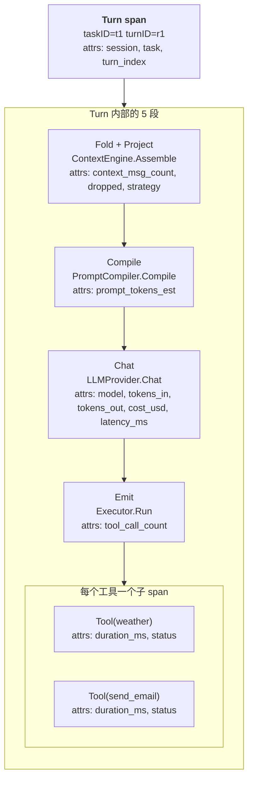

# Chapter 2 · Runtime Data Flow

> 第 1 章讲清了世界里有哪些名词。这一章讲**每次 Turn 里数据是怎么流的**——把 6 个接口拼成一条流水线,并给出可以端到端跑的 Runtime 协调器。

---

## 2.1 问题:接口对了,串起来还是会错

第 1 章的 6 个接口如果各自看,都很干净:

```
ContextEngine.Assemble → domain.Context
PromptCompiler.Compile → Messages
LLMProvider.Chat       → LLMResponse
Executor.Run           → []Event
State.Apply            → ()
EventStore.Append/Load → ...
```

各写一遍 unit test 全都过。但真拼到一起,一堆隐蔽的错就冒出来:

- **数据结构错配**。ContextEngine 返回的 `Context.Messages` 里 `Role="tool"` 的消息忘了填 `ToolCallID`,PromptCompiler 照单全收,LLM 一看 400 报错。**每一个接口的输出都同时是下一个接口的输入,契约必须显式**。
- **状态没落地就再读一次**。Executor 追加了 `ToolReturned` Event 到 EventStore,但 State 还没 `Apply`;下一 Turn 的 ContextEngine 从 State 读,读不到工具结果,LLM 又调一次同样的工具。**Append 与 Apply 的顺序不是自由的**。
- **观测粒度错位**。想看"这次 LLM 慢在哪",发现只有一个 `HTTP 200` 的日志——因为没人告诉观测层"这段箭头到那段箭头之间是一次 LLM 请求"。**观测点必须与数据流的段边界对齐,不能事后追加**。
- **失败回滚不明确**。工具跑了一半,LLM 又超时,Turn 该结束在哪个状态?没有明确的数据流协议时,一半会写"已发送邮件"一半会写"Task 失败",两种事实并存。

**这一章的解法**:把 6 个接口串成**一条明确的、单向的、每一段都有确定输入输出的数据流**,然后给它一个协调器实现,让"如何拼"这件事变成代码而不是习惯。协议本身沉淀在 [ADR-002 · Runtime 数据流协议](../adr/ADR-002-dataflow-protocol.md),本章是它的第一次落地。

---

## 2.2 一次 Turn 的完整数据流

先看总图。原图见 [`diagrams/ch02-dataflow.mmd`](../diagrams/ch02-dataflow.mmd)。

```mermaid
flowchart LR
    ES[(EventStore)]
    ST[[State]]
    CE[[ContextEngine]]
    PC[[PromptCompiler]]
    L[[LLMProvider]]
    EX[[Executor]]
    T[(Tool Runtime)]

    ES -- "&#91;&#93;Event" --> ST
    ST -- "SessionView (Fold)" --> CE
    CE -- "Context (Project)" --> PC
    PC -- "Messages (Compile)" --> L
    L -- "LLMResponse" --> EX
    EX -- "ToolCall" --> T
    T -- "ToolResult" --> EX
    EX -- "&#91;&#93;Event (Emit)" --> ES
```



每根箭头都标了流过去的具体数据结构。这个约束比"框图"重要得多——**箭头旁边的类型就是这一段的接口契约**,不是随手画的示意。

**读法**:一次 Turn 就是把左边这个循环从 `EventStore` 出发跑一遍,产出的新 `[]Event` 又回到 `EventStore`,组成下一个 Turn 的 `SessionView`。

---

## 2.3 数据流的四种形态转换

把上图抽出来,一次 Turn 的数据从头到尾经过 **4 种转换 + 1 个外部调用**:

| 转换        | 类型签名                             | 责任                                                         |
| ----------- | ------------------------------------ | ------------------------------------------------------------ |
| **Fold**    | `[]Event → SessionView`              | 把追加式的事件流折叠成"当前状态"。State 层。                 |
| **Project** | `SessionView → Context`              | 从状态投影出这次要发送的上下文。ContextEngine 层。           |
| **Compile** | `Context → Messages`                 | 把结构化上下文编译成 LLM 认识的消息序列。PromptCompiler 层。 |
| **Chat**    | `Messages → LLMResponse`             | 请求 LLM,得到响应。LLMProvider 层。                          |
| **Emit**    | `LLMResponse + ToolResult → []Event` | 把响应与工具结果落回 Event 流。Executor 层。                 |

其中 **Fold / Project / Compile 是纯函数**——同样输入必然同样输出,没有副作用。这是能"回放、快照、并发读"的前提。**Chat / Emit 有副作用**(网络调用 / 工具副作用)。这条边界不是修辞,是设计约束——违反它就丧失第 1 章 §1.1 的"回放"痛点解法(见 §2.5)。

**Go / Rust 里长这样。**

**Go:**

```go
// runtime-go/state/state.go
type State interface {
    Apply(events []domain.Event) error                            // Fold
    View(sessionID string) (domain.SessionView, error)
}
// runtime-go/context/context.go
type ContextEngine interface {
    Assemble(ctx context.Context, sessionID, taskID string) (domain.Context, error)  // Project
}
// runtime-go/prompt/prompt.go
type PromptCompiler interface {
    Compile(c domain.Context) (Messages, error)                   // Compile
}
// runtime-go/llm/llm.go
type LLMProvider interface {
    Chat(ctx context.Context, msgs prompt.Messages, tools []domain.Tool) (domain.LLMResponse, error)  // Chat
}
// runtime-go/executor/executor.go
type Executor interface {
    Run(ctx context.Context, turn domain.Turn) ([]domain.Event, error)  // Emit
}
```

**Rust:**

```rust
// runtime-rs/src/state.rs
pub trait State {
    fn apply(&mut self, events: &[Event]) -> Result<(), StateError>;
    fn view(&self, session_id: &str) -> Result<SessionView, StateError>;
}
// runtime-rs/src/context.rs
pub trait ContextEngine {
    fn assemble(&self, session_id: &str, task_id: &str) -> Result<Context, ContextError>;
}
// runtime-rs/src/prompt.rs
pub trait PromptCompiler {
    fn compile(&self, ctx: &Context) -> Result<Messages, PromptError>;
}
// runtime-rs/src/llm.rs
pub trait LLMProvider {
    fn chat(&self, msgs: &Messages, tools: &[Tool]) -> Result<LLMResponse, LLMError>;
}
// runtime-rs/src/executor.rs
pub trait Executor {
    fn run(&self, turn: &Turn) -> Result<Vec<Event>, ExecutorError>;
}
```

**契约的关键点**——不写清楚,后面会踩坑:

1. **Fold 的输入必须是从会话起点开始的完整 Event 流**;或者从某个 Checkpoint 开始(ch09)。**中间截取一段就 Fold 是非法的**——因果链会断。
2. **Project 只能读 SessionView,不能写 Event**;它是纯查询,没有副作用。
3. **Compile 的输入 `Context` 已经是"确定要发出去的消息"**,不做进一步的选择/过滤。这是 ContextEngine 的责任(见 §2.5)。
4. **Chat 的输入 `Messages` 必须已经通过 Compile 校验过**——LLM Provider 不做二次验证。
5. **Emit 的输出 `[]Event` 必须归属到当前 Turn**——所有事件的 `TurnID` 与传入的 `turn.ID` 一致。协调器会检查这一点。
6. **Emit 的概念签名与 `Executor.Run` 的实际签名刻意不同**。表里写 `LLMResponse + ToolResult → []Event`,但 `Run` 的参数只有 `Turn`——`LLMResponse` 不走参数传递,Executor 从事件流里读该 Turn 最近的 `LLMReplied`,从中拿到要执行的 tool calls。这让"LLM 说了什么"只有一个来源(事件流),Executor 崩溃重启后也能从事件流续跑,不依赖内存里的响应对象。

---

## 2.4 谁负责组装:Runtime 协调器

上面 5 段箭头需要一个东西把它们串起来。放业务代码里等于让"数据流协议"在每个调用点重新讲一遍——这就是 §2.1 那些错误的温床。

**答案是显式的 `Runtime` 类型**:持有 6 个接口,`Step()` 跑一个 Turn。

**Go:** `runtime-go/runtime/runtime.go`(为压缩篇幅,以下节选用 `_` 略去了错误处理;完整实现逐一检查并向上返回错误)

```go
type Runtime struct {
    EventStore state.EventStore
    State      state.State
    Context    rtctx.ContextEngine
    Prompt     prompt.PromptCompiler
    LLM        llm.LLMProvider
    Executor   executor.Executor
}

func (r *Runtime) Step(ctx context.Context, sessionID, taskID, turnID string) ([]domain.Event, error) {
    // 0. 前置:TurnStarted 由调用方追加,协调器只做"驱动 Turn 内部"这一件事。
    view, _ := r.State.View(sessionID)
    if v, ok := view.LastTurn[taskID]; !ok || v.ID != turnID {
        return nil, errors.New("turn not started")
    }

    // 1. Fold + Project
    c, _ := r.Context.Assemble(ctx, sessionID, taskID)
    c.TurnID = turnID

    // 2. Compile
    msgs, _ := r.Prompt.Compile(c)

    // 3. Chat(带 LLMRequested / LLMReplied 两条 Event)
    r.append(domain.EvtLLMRequested, /* payload */)
    resp, _ := r.LLM.Chat(ctx, msgs, c.Tools)
    r.append(domain.EvtLLMReplied, /* payload */)

    // 4. Emit(工具调用)
    if len(resp.ToolCalls) > 0 {
        toolEvents, _ := r.Executor.Run(ctx, domain.Turn{ID: turnID, TaskID: taskID})
        for _, e := range toolEvents { r.append(e.Type, e.Payload) }
    }

    // 5. TurnEnded
    r.append(domain.EvtTurnEnded, /* payload */)
    return appended, nil
}
```

**Rust:** `runtime-rs/src/runtime.rs`(签名等价,只列关键行)

```rust
pub struct Runtime {
    pub event_store: Arc<Mutex<dyn EventStore + Send>>,
    pub state:       Arc<Mutex<dyn State + Send>>,
    pub context:     Arc<dyn ContextEngine + Send + Sync>,
    pub prompt:      Arc<dyn PromptCompiler + Send + Sync>,
    pub llm:         Arc<dyn LLMProvider + Send + Sync>,
    pub executor:    Arc<dyn Executor + Send + Sync>,
}

impl Runtime {
    pub fn step(&self, session_id: &str, task_id: &str, turn_id: &str)
        -> Result<Vec<Event>, StepError>
    {
        // 与 Go 版结构一致:前置检查 → Fold+Project → Compile → Chat → Emit → TurnEnded
    }
}
```

**为什么这样切分**:

- **`Session.Open`、`Task.Create`、`Turn.Start`、`Task.End` 不在 Step 里**。这四个生命周期事件由调用方(应用/上层 loop)追加。Runtime 只负责"给定一个已经就绪的 Turn,把它跑完"。这条划分让 Runtime 可以被复用于"重放模式"(不发起新 Turn 只回放旧 Event)、"人机对话"、"批处理"等多种上下文。
- **每一条 Event 都是 `Append + Apply` 两步一起做**——这保证 State 从来不会落后于 EventStore(见 §2.5 单向数据流)。协调器里的 `append()` 闭包封装了这个约束。
- **Runtime 是无锁可重入的**——同一时间可以为不同 `(sessionID, taskID)` 并行调 Step,只要底层 EventStore/State 是并发安全的。

**放什么、不放什么**:

- 重试策略、限流、Budget 检查——**都不放**在 `Step` 里,放上层 Loop。理由:一个 Step 是"一次跑到底"的语义,失败就返回错误,让调用方决定下一步。
- Streaming、并行工具、Human-in-the-loop——**这一版本不支持**。ch08 Executor 会把 Step 拆成"submit + resume"两半来承载这些场景。

---

## 2.5 单向数据流:为什么箭头只能一个方向

§2.2 那张图上所有箭头都有明确方向。**下游写上游 = 违反数据流协议**,后果:

| 违反                | 症状                                          | 谁会踩到                      |
| ------------------- | --------------------------------------------- | ----------------------------- |
| Project 写 Event    | Context 变成"活对象",两次 Assemble 结果不一样 | 缓存/幂等/并发全崩            |
| Compile 读 State    | Prompt 不再是 Context 的纯函数                | 回放失败,Prompt 每次不同      |
| LLM 感知 State      | LLM 请求变成"隐式带状态",Provider 不可替换    | 换模型/换 Provider 时行为漂移 |
| Executor 改 Context | 工具执行产生"看不见的"上下文变化              | ch04 上下文压缩后行为改变     |
| Fold 有副作用       | 折叠不再幂等,重放会重发副作用                 | ch09 Checkpoint 失效          |

**具体例子:一个编译过但错的实现**

```go
// 反例:Context 里塞了工具调用,让 Executor 顺便干活。
type ContextEngineWrong struct{}
func (ContextEngineWrong) Assemble(ctx context.Context, sid, tid string) (domain.Context, error) {
    // ...拼 Messages 时,顺便执行了一次 weather 工具去获取"最新"天气填进 system prompt
    weather := callWeather()                      // ⚠️ Project 里有副作用
    return domain.Context{Messages: []domain.Message{
        {Role: "system", Content: "today's weather: " + weather},
    }}, nil
}
```

这段代码 `go vet` 一点问题都没,demo 也能跑。踩坑发生在:

- ch09 从 Checkpoint 恢复:重放 Event 时又调用了一次 `callWeather`,产生新的外部请求(可能付钱)。
- 并发压测:同一 Session 并发两次 Assemble,同时打了两个 weather API,配额爆了。
- 换 ContextEngine 实现:所有"隐式副作用"跟着新实现一起改变,业务逻辑无法平移。

**正确做法**:把 `callWeather` 变成一个显式的 Tool,让 LLM 通过 `ToolCall` 触发,Executor 负责调、结果作为 `ToolReturned` Event 落回 —— 副作用被限制在**唯一一条**流水线段上。

---

## 2.6 观测点:每根箭头一个 Span

数据流图直接给出 Trace 的结构。**Turn 是根 Span,5 段转换是子 Span**。原图见 [`diagrams/ch02-tracing.mmd`](../diagrams/ch02-tracing.mmd):



**为什么必须这样切,而不是随便加日志**:

1. **Span 边界 = 契约边界**。每段转换的输入输出都是可枚举的类型(§2.3),Span 的 `start/end` 与"契约进入/退出"一一对应,不用猜。
2. **能直接回答"慢在哪"**——Chat span 的耗时是模型往返,Emit span 的耗时是工具执行,Fold+Project 的耗时是折叠成本。§2.1 那句"HTTP 200 一条日志"的困境消失。
3. **Attribute 天然对齐**。Chat span 挂 `tokens_in / tokens_out / cost`;Emit span 每个工具挂 `tool_name / duration / status`。ch10(Evaluation & Optimization)会把这套 Attribute 定成规范,并映射到 OTel Semantic Conventions——评测与观测共用同一套指标。

本章不写 OTel 集成代码——集成随 ch10 的评测框架一起落地。这里的规则是:**新加任何观测点前,先问"它是哪根箭头上"**。找不到对应箭头,说明观测点选错了,或者你在偷偷加箭头(违反 §2.5)。

---

## 2.7 失败与退化

数据流的每一段都可能失败。ch01 §1.1 的"崩溃 / 中断"痛点在这里落成**具体的失败策略**:

| 段          | 失败原因(典型)                         | 策略                                                                       | 落到 Event                                        | 是否终止 Turn    |
| ----------- | -------------------------------------- | -------------------------------------------------------------------------- | ------------------------------------------------- | ---------------- |
| **Fold**    | Event 流损坏 / 反序列化失败            | **拒绝服务**——不猜、不跳过。                                               | `TaskEnded{status=failed, reason="fold: ..."}`    | 是               |
| **Project** | 引用了不存在的 taskID / 状态视图缺字段 | 记录 Event,降级到"最小 Context"(只带 system + 最近一条 UserSpoke)          | `ContextCompressed{strategy="fallback:minimal"}`  | 否,继续跑        |
| **Compile** | Messages 长度超模型窗口 / 类型不对     | 记录 Event,拒绝本 Turn 的 LLM 调用                                         | `TurnEnded{status=failed, reason="compile: ..."}` | 是               |
| **Chat**    | 网络超时 / 429 / 5xx                   | 上层 Loop 有限重试(3 次,指数退避);全部失败后 emit `TurnFailed`             | `TurnEnded{status=failed, reason="llm: ..."}`     | 是               |
| **Emit**    | 工具超时 / 副作用一半成功              | 每个 `ToolReturned` 用 `IsError=true` 记录;LLM 下一 Turn 决定重试/告诉用户 | `ToolReturned{is_error=true}`                     | 否,交给下一 Turn |

**关键选择**:

- **Fold 失败 = 全站停摆**。这是刻意的——事件流是唯一真相,损坏了就不能继续假装正常。ch03 会讨论如何用 append-only 存储 + 校验和让它极少发生。
- **Project 可以降级**。因为 ContextEngine 的策略是可插拔的,失败退回"最小 Context"给 LLM 一个求救的机会。ch04 会讨论多级降级。
- **Chat 的重试策略在上层 Loop**,不在 `Step` 里。Runtime 语义是"一次跑到底,失败返回",让 Loop 决定"再试一次 vs 终止 Task"。这条边界让 Runtime 保持简单。
- **Emit 层面的"一半成功"** 是最真实的痛。副作用已经发生,回滚不了。策略是**如实记录**:`ToolReturned{is_error=true, content="邮件已发,但记录写库失败"}`——下一 Turn 的 LLM 或 Human-in-the-loop 决定怎么补救。这里的哲学是:**不承诺原子性,承诺可审计**。

---

## 2.8 走一遍:ch01 样本再跑一次(这次是 Runtime 生成)

第 1 章 §1.6 给了一份手工构造的 19 条 Event。这一节用 `Runtime.Step` **端到端跑一遍同样的场景**,验证协调器实现符合 §2.2 的数据流协议。

**Go:**

```bash
cd runtime-go && go run ./examples/ch02
```

**Rust:**

```bash
cd runtime-rs && cargo run --example ch02
```

两种语言的输出结构相同:

```
== Event 流(20 条) ==
  e01 SessionOpened  ...
  e02 UserSpoke      ...
  e03 TaskCreated    ...
  e04 TurnStarted    turn=r1
  e05 LLMRequested   turn=r1
  e06 LLMReplied     turn=r1
  e07 ToolCalled     turn=r1
  e08 ToolReturned   turn=r1
  e09 TurnEnded      turn=r1
  ...
  e19 TurnEnded      turn=r3
  e20 TaskEnded

== 折叠后的 SessionView ==
  session:  id=s1 principal=user-42
  task:     id=t1 goal="查天气 + 发邮件" status=Succeeded
  turn:     task=t1 id=r3 index=2 status=Done tokens_in=700 tokens_out=20
  total tokens_in: 1830
```

**与 ch01 手工样本的差异**:**Runtime 版有 20 条 Event,ch01 是 19**。多出来的是 Turn 3 的 `LLMRequested`——ch01 手工构造时省略了它,而 §2.4 的协调器**总是**先追加 `LLMRequested` 再 `Chat`,即使这个 Turn 只是收尾没有工具调用。**这是协议兑现的证据**——协调器忠于数据流,不做"看着不重要就省一条"的优化。

**测试**:两语言各有一个集成测试严格断言这三件事:

1. Event 数 = 20
2. `Task.status == Succeeded`, 最后 `Turn.id == r3, index == 2`
3. `Σ TurnEnded.tokens_in == 1830`(与 ch01 手工样本一致——**这条断言证明"手工事实"和"Runtime 生成事实"在关键指标上收敛**)

```bash
go test ./examples/ch02 -v
cargo test ch02
```

---

## 2.9 取舍记录

| 决策                            | 选择                                                  | 代价                                                       | 什么情况下会被推翻                                                             |
| ------------------------------- | ----------------------------------------------------- | ---------------------------------------------------------- | ------------------------------------------------------------------------------ |
| 谁持有依赖                      | 显式 `Runtime` 结构体聚合 6 个接口                    | 依赖注入代码变啰嗦;换实现要动 `Runtime{}` 字面量           | 走向"多 Agent 编排"时会升级为 `ExecutorPool` + `Runtime` 池,详见 ch08          |
| 生命周期事件谁追加              | Session/Task/Turn 的 Start/End 由调用方追加,Step 不管 | 应用侧要写 append 样板                                     | 若引入统一的 `Session.Run(task)` 门面,会把这层样板收进 Runtime 内部            |
| Append 与 Apply 顺序            | 每条 Event **先 Append 再 Apply,同一函数内完成**      | 单条 Event 要两次锁                                        | 追求极端吞吐时,可能改成"批量 Append + 批量 Apply",但要证明因果一致性没破       |
| Fold/Project/Compile 是否纯函数 | 是——不允许副作用                                      | ContextEngine 里不能"顺便"发外部请求;所有 IO 都必须走 Tool | 若引入"懒加载向量库"这种真正需要的副作用,加 ADR 开逃生舱,但只对该子集破例      |
| 重试策略在哪                    | 上层 Loop,Step 只跑一遍                               | 简单 demo 要多写一个 Loop                                  | 若 Runtime 需要"内建 Auto-Retry" API,加一个 `AutoRetryOption`,不改 `Step` 语义 |
| 观测代码在哪                    | 本章不写 OTel,只声明 span 边界                        | 想直接用得等 ch10                                          | 若某个 span 边界发现挂不上必要 attribute,先动 §2.3 契约,不动观测层             |

---

## 2.10 小结

- 数据流 = **4 种转换 + 1 次 Chat + 6 个接口 + 1 个协调器**。
- 每根箭头是一个 Span 边界;违反箭头方向 = 违反 §1.2 的事件优先决策。
- Runtime 协调器已经用 Go / Rust 各实现一份,能通过内存 fake 端到端跑通"查天气 + 发邮件",测试证明与 ch01 手工样本在关键指标(20 条 Event、Task 成功、tokens_in=1830)上收敛。
- Fold / Project / Compile 是纯函数,是回放/快照/并发的底座。Chat / Emit 有副作用,是需要"如实记录、不承诺原子性、承诺可审计"的段。

下一章 **State & Event Model** 会把 `Fold` 这一段落成完整实现:Event schema、序列化、Checkpoint、追加与并发。

---

## 参考

- [ADR-001 · Runtime 的边界与职责](../adr/ADR-001-runtime-domain.md)
- [ADR-002 · Runtime 数据流协议](../adr/ADR-002-dataflow-protocol.md)——本章的正式协议沉淀
- 参考实现:
    - Go: [`runtime-go/runtime/runtime.go`](../runtime-go/runtime/runtime.go)、[`runtime-go/runtime/memfakes/memfakes.go`](../runtime-go/runtime/memfakes/memfakes.go)
    - Rust: [`runtime-rs/src/runtime.rs`](../runtime-rs/src/runtime.rs)
- 端到端 demo:
    - Go: [`runtime-go/examples/ch02/main.go`](../runtime-go/examples/ch02/main.go)
    - Rust: [`runtime-rs/examples/ch02/main.rs`](../runtime-rs/examples/ch02/main.rs)
- 图源: [`diagrams/ch02-dataflow.mmd`](../diagrams/ch02-dataflow.mmd)、[`diagrams/ch02-tracing.mmd`](../diagrams/ch02-tracing.mmd)
- 相关章节:`ch01-runtime-domain.md`、`ch03-state-event.md`、`ch04-context-engine.md`、`ch08-executor.md`、`ch10-eval.md`
